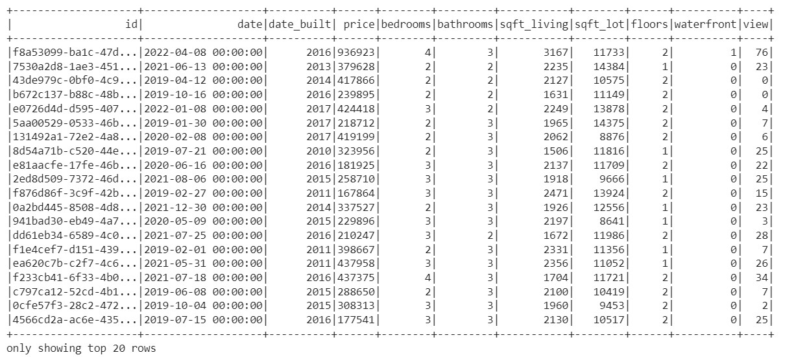
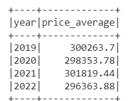
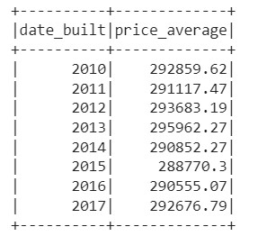
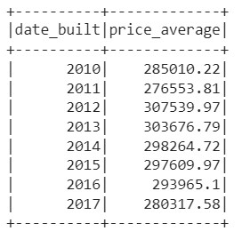
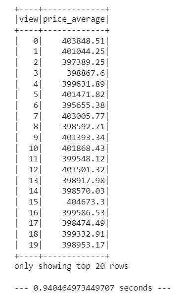
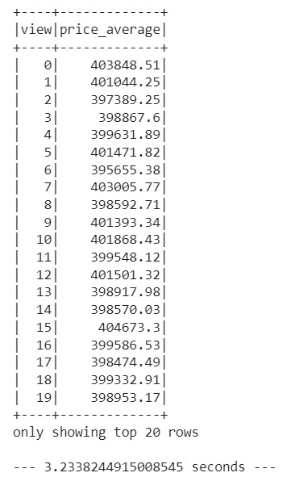
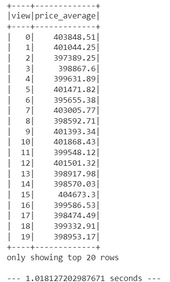

# Home_Sales
## Instructions
1. Rename the Home_Sales_starter_code.ipynb file as Home_Sales.ipynb.

2. Import the necessary PySpark SQL functions for this assignment.

3. Read the home_sales_revised.csv data in the starter code into a Spark DataFrame.

4. Create a temporary table called home_sales.

## Answer the following questions using SparkSQL:

5. What is the average price for a four-bedroom house sold for each year? Round off your answer to two decimal places.

6. What is the average price of a home for each year it was built that has three bedrooms and three bathrooms? Round off your answer to two decimal places.

7. What is the average price of a home for each year that has three bedrooms, three bathrooms, two floors, and is greater than or equal to 2,000 square feet? Round off your answer to two decimal places.

8. What is the "view" rating for homes costing more than or equal to $350,000? Determine the run time for this query, and round off your answer to two decimal places.

9. Cache your temporary table home_sales.

10. Check if your temporary table is cached.

11. Using the cached data, run the query that filters out the view ratings with an average price of greater than or equal to $350,000. Determine the runtime and compare it to uncached runtime.

12. Partition by the "date_built" field on the formatted parquet home sales data.

13. Create a temporary table for the parquet data.

14. Run the query that filters out the view ratings with an average price of greater than or equal to $350,000. Determine the runtime and compare it to uncached runtime.

15. Uncache the home_sales temporary table.

16. Verify that the home_sales temporary table is uncached using PySpark.

17. Download your Home_Sales.ipynb file and upload it into your "Home_Sales" GitHub repository.
